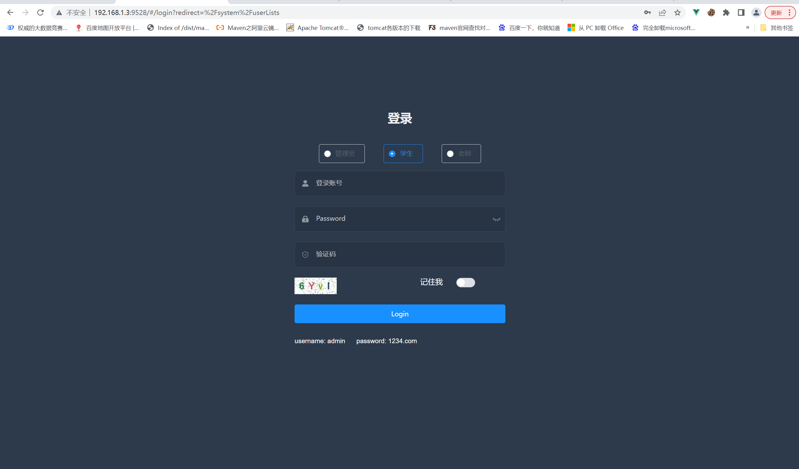
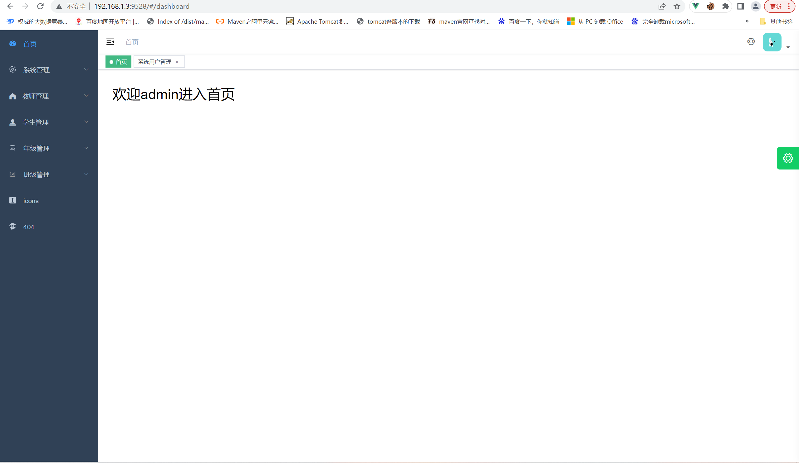
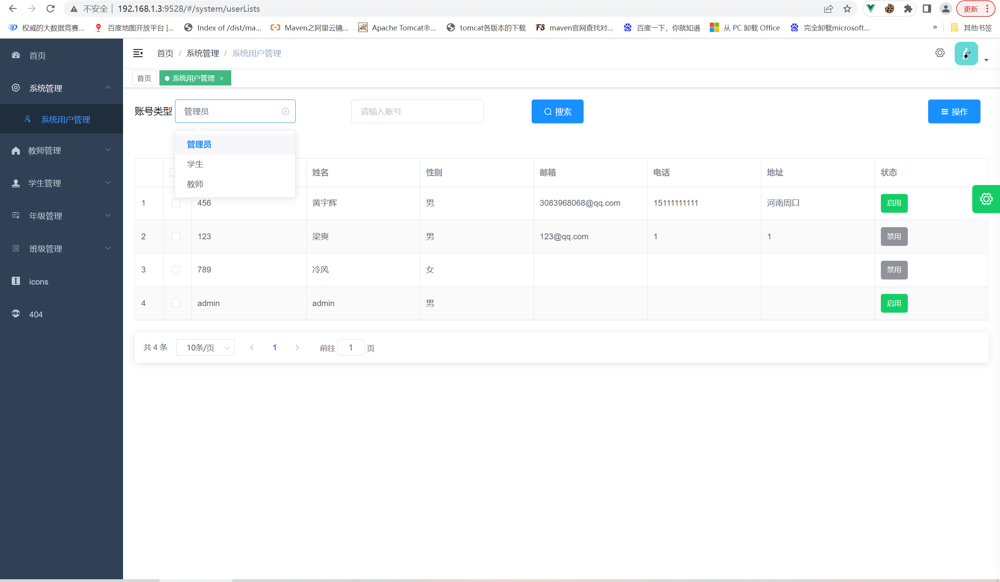
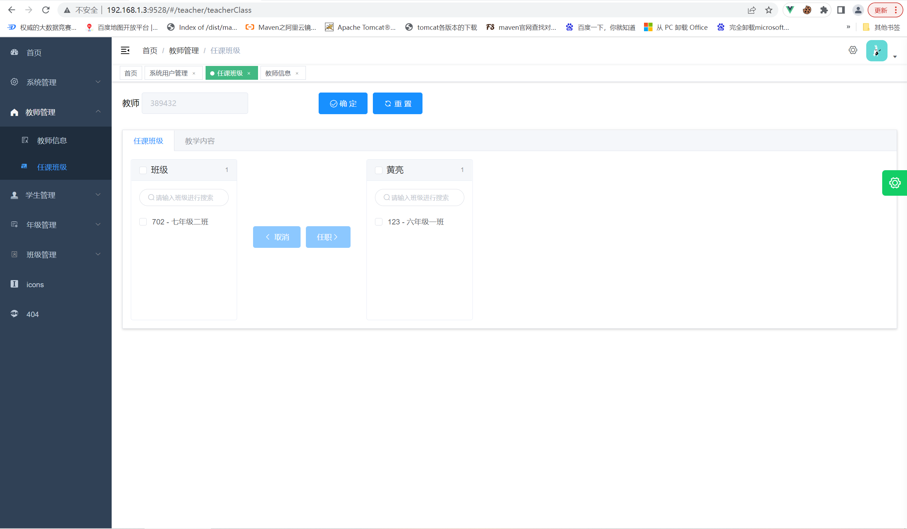
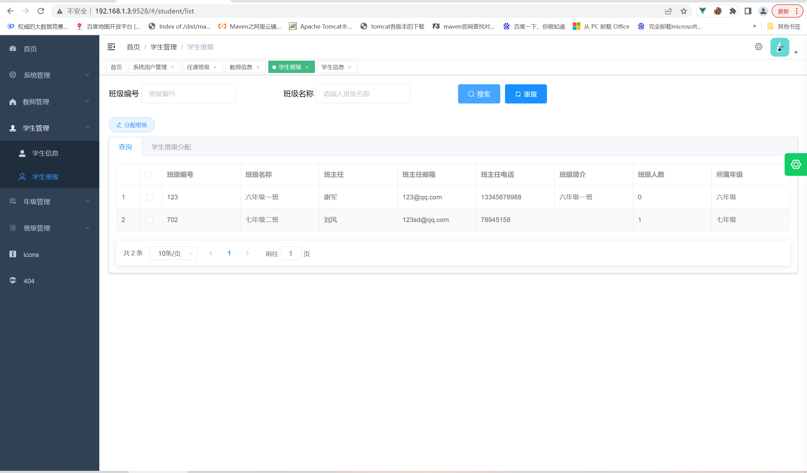
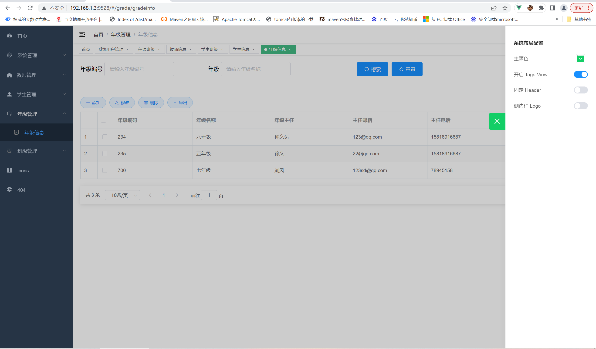
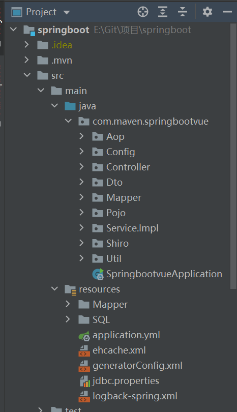
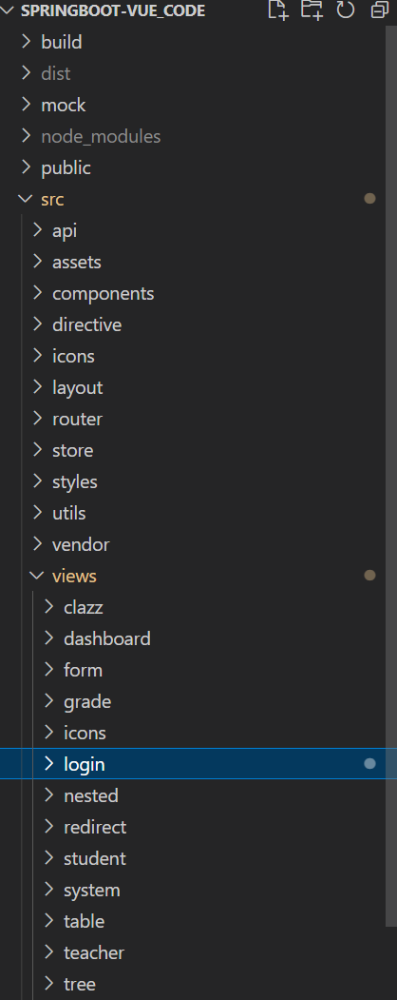

### 简介

------

​		本项目是学生管理系统，参考https://github.com/GoogTech/sms-ssm，原项目主要是使用SSM+JSP的技术进行开发。主要是以该项目的一些理念和数据库作为参考，在原基础上使用最新的技术进行开发，实现前后端分离。

​		前端：使用vue-admin-element的基础骨架进行二次开发，参考vue-element-admin的。实现页面权限限制，根据不同的用户类型动态生成路由表。还有一些细节大家可以去查看源码，个人建议还是使用基础骨架的模板进行开发，若有其他可以借鉴或者根据具体需求进行设计。

​		后端：使用了第三方框架shiro在过滤器层面实现用户认证，同时摆脱session的限制，使用JTW技术生成口令返回给前端。导出功能是使用Easyexcel插件，是比较好用的excel处理工具。

​		特别说明： 在本项目中：tb_admin、tb_student、tb_teacher的isdelete字段是代表账号的启用、禁用状态。 tb_clazz、tb_grade的isdelete是代表该数据是否删除

### 涉及技术

前端：主要是使用vue、elementui、vuex、vue-router和一些第三方工具

后端：springboot、mybatis-plus、Easyexcel、fastjson、shiro（认证和授权框架）、JWT、EHCache（mybatis第三方缓存）

### 项目截图

#### 登录界面

#### 首页

#### 

#### 系统用户管理

#### 教师管理

#### 学生管理

#### 年级管理

#### 系统主题

### 系统模块介绍

------

#### 后端

| 文件                | 说明                                       |
| ------------------- | ------------------------------------------ |
| AOP                 | 切面的实现，暂时未进行具体一些实现         |
| Config              | 配置类，目前只有shiroConfig配置类          |
| Controller          | 控制器，用于请求的访问                     |
| DTO                 | 封装一些实体类用于接收前端的数据或响应数据 |
| Mapper              | DAO层                                      |
| Pojo                | 实体类，对应数据库的表                     |
| Service.Impl        | 封装具体的业务逻辑                         |
| Shiro               | 实现shiro的认证逻辑和过滤器                |
| Util                | 实现的一些工具类，比如JWTUtil              |
| application.yml     | 项目的配置在此设置                         |
| ehcache.xml         | 第三方缓存配置文件                         |
| generatorConfig.xml | 逆向工程配置文件                           |
| jdbc.properties     | 数据库配置                                 |
| logback-spring.xml  | 日志文件配置                               |

#### 前端

| 文件       | 说明                                        |
| ---------- | ------------------------------------------- |
| api        | axios的请求                                 |
| assets     | 404t图片                                    |
| components | 各种常用组件                                |
| directive  | 自定义指令                                  |
| icons      | svg的图标                                   |
| layout     | 主要布局，例如头部面包屑，侧边栏            |
| router     | 主路由和各个模块的路由                      |
| store      | 全局状态管理                                |
| style      | 样式                                        |
| utils      | 常用的一些方法，包括已封装好的axios-request |
| vendor     | 封装好的导出excel的js                       |
| views      | 放置侧边菜单栏各个模块的组件                |

### 开发

前端

#克隆项目

gitee	git clone https://gitee.com/the-starry-sky-is-yes/springboot-vue_code.git

github	git clone https://github.com/ucxbj123/springboot-vue_code.git

#进入项目目录

cd  springboot-vue_code/

#安装依赖

npm install  或者	npm install --legacy-peer-deps

#启动服务

npm run dev

#访问

浏览器访问 [http://localhost:9528](http://localhost:9528)

#发布-构建生产环境

 npm run build:prod

后端

#克隆项目

gitee git clone  https://gitee.com/the-starry-sky-is-yes/springboot.git

github git clone  https://github.com/ucxbj123/springbootvue.git

用idea打开项目，下载依赖

本项目用是8.0.18版本的mysql，可以根据自己的情况改变依赖和jdbc.properties的配置

创建数据库并导出sql文件-springbootvue.sql

### 交流

后续有补充或者功能拓展会持续更新，并且近期会搭建一个云服务器，大家可以线上进行预览。

大家可以加入群进行技术交流，谢谢。

